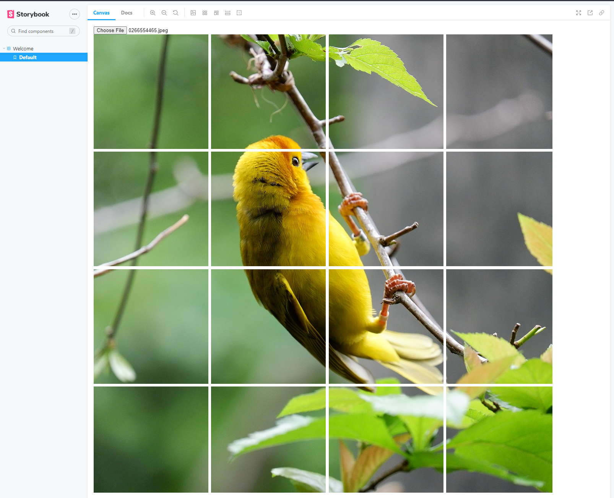

#
# Gridderer
#### A React component to split up an image into a grid of seperate images, which can then be posted to persistant memory. 
##### Based on: https://codepen.io/Escu/pen/KVLBYP
---


```javascript
import { Gridderer } from 'gridderer'

<Gridderer tilesCountX={8} tilesCountY={6} gridOffset={1.005} />
```

---
Using Tsdx, React, Storybook, Styled-Components
---

### Todos:
- [ ] Type it!
- [ ] Fix tests
- [ ] Write unit test
- [x] How can this be integrated into a form? See answer below
- [x] How can load single low res but then high-res grid sections zoom on hover? A cb into the input should be enough to surface the data which can be saved in state and then passed as prop to ImageViewer. Will need to include grid data.
- [x] How can it be styled? Styled-Components
- [x] How can input, image view, zoom view, all work together? See above 'how can load'
- [ ] Currently converts DataImage back to Base64. What about other options?
- [ ] Pie in the sky, how can we let users free hand draw shapes to grid out?
- [ ] Github Actions to release to NPM